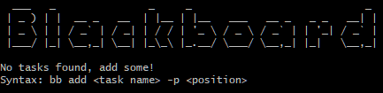

# Blackboard

Using text files under the hood, Blackboard aims to be a minimalistic task management app that focuses on what feels natural.
If you find yourself needing a place to quickly jot down things that need to be done, as well as keep track of what order you should do them in, this is probably the tool for you.

Blackboard is opinionated and doesn't try to be something that it isn't:
- No task priorities
- No due dates
- No urgency flags

When used in conjunction with a more elaborate task management system such as Jira, Trello, Asana or ClickUp (to name a few), this satisfies that gap in between: where tasks aren't quite within scope of those boards, but still need to get done.

## Highlights

- Add tasks to your list, at any position
- Bump tasks to the top of your list
- Slump tasks to the bottom of your list
- Move tasks to specific positions
- Remove tasks from the list when completed
- Wipe all tasks

## Installation

TBD - Likely to be on npm

## Usage/Examples

### Add a task

```
# Add a task to the bottom of the list
bb add "Get back to John re. our upcoming API integration"

# Add a task in position 4
bb add "Schedule a meeting that should just be an email" -p 4
```

### Bump a task to the top

```
# Bump task 3 to the top
bb bump 3
```

### Slump a task to the bottom

```
# Slump task 5 to the bottom
bb slump 5
```

### Move a task to a certain position

```
# Move task 7 to position 2
bb move 7 2
```

### Remove a task

```
# Remove task 9
bb remove 9
```

### Wipe all tasks

```
# Wipe tasks by deleting tasks.txt
bb wipe
```

## Authors

- [@keydose](https://www.github.com/keydose)

## Acknowledgements

- [Inspired by Taskbook](https://github.com/klaussinani/taskbook)

## Highlights

- Add tasks to your list, at any position
- Bump tasks to the top of your list
- Slump tasks to the bottom of your list
- Move tasks to specific positions
- Remove tasks from the list when completed

## Installation

TBD - Likely to be on npm
  
## Authors

- [@keydose](https://www.github.com/keydose)


## Acknowledgements

 - [Inspired by Taskbook](https://github.com/klaussinani/taskbook)

## Contributing

Contributions are always welcome!

As this is just a hobby project for learning Go, I am almost certain that there will be plenty of ways to make efficiency improvements, or tidy things up. 

